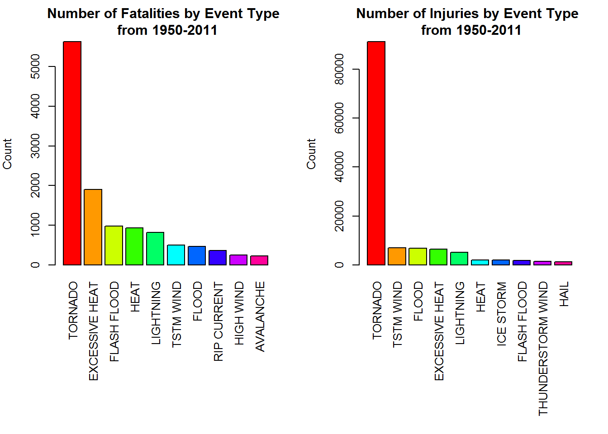
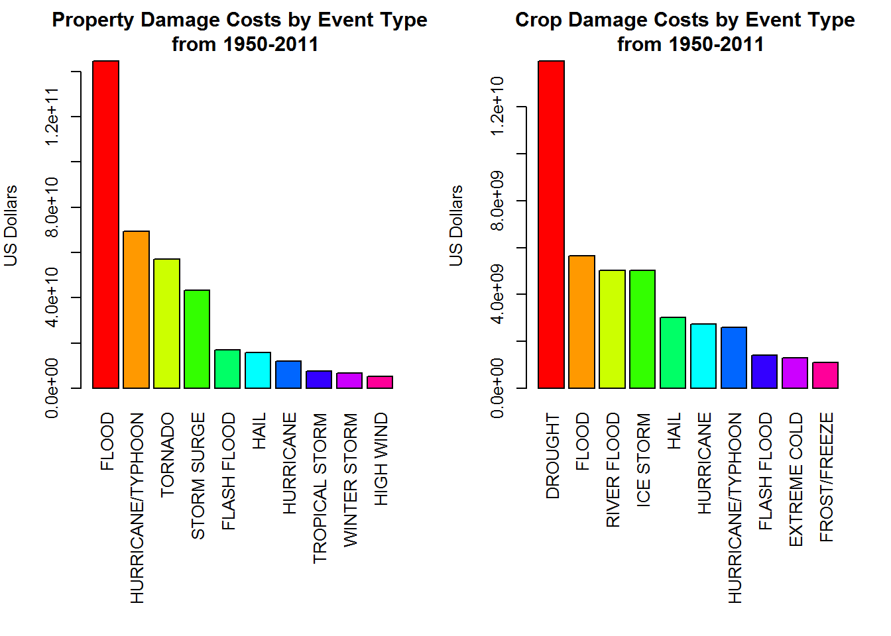

# Analysis of NOAA Storm Data from 1950 to 2011
Thomas Glucksman  
December 23, 2016  


# Synopsis

In this report we aim to answer two distinct questions:

1. Across the United States, which types of events are most harmful with respect to population health?
2. Which types of events have the greatest economic consequences?

We will do this by examining the NOAA Storm Database, which contains information from 1950 to 2011 tracking
characteristics of major storms across the United States. These include attributes such as each storm's time 
and location, and their effects on population and economic welfare (fatalities, injuries, property damage).

# Data Processing

### Reading in Storm Data

We download the data directly from the link below and read it into R with the <span style="font-family:Courier">**read.csv**</span> function. Although it is downloaded in the .bz2 format this fuction can handle compressed files, so no further steps are required.

```r
file <- "https://d396qusza40orc.cloudfront.net/repdata%2Fdata%2FStormData.csv.bz2"
download.file(file, destfile = "StormData.csv.bz2")

storms <- read.csv("StormData.csv.bz2")
dim(storms)
```

```
## [1] 902297     37
```

```r
head(storms)
```

```
##   STATE__           BGN_DATE BGN_TIME TIME_ZONE COUNTY COUNTYNAME STATE
## 1       1  4/18/1950 0:00:00     0130       CST     97     MOBILE    AL
## 2       1  4/18/1950 0:00:00     0145       CST      3    BALDWIN    AL
## 3       1  2/20/1951 0:00:00     1600       CST     57    FAYETTE    AL
## 4       1   6/8/1951 0:00:00     0900       CST     89    MADISON    AL
## 5       1 11/15/1951 0:00:00     1500       CST     43    CULLMAN    AL
## 6       1 11/15/1951 0:00:00     2000       CST     77 LAUDERDALE    AL
##    EVTYPE BGN_RANGE BGN_AZI BGN_LOCATI END_DATE END_TIME COUNTY_END
## 1 TORNADO         0                                               0
## 2 TORNADO         0                                               0
## 3 TORNADO         0                                               0
## 4 TORNADO         0                                               0
## 5 TORNADO         0                                               0
## 6 TORNADO         0                                               0
##   COUNTYENDN END_RANGE END_AZI END_LOCATI LENGTH WIDTH F MAG FATALITIES
## 1         NA         0                      14.0   100 3   0          0
## 2         NA         0                       2.0   150 2   0          0
## 3         NA         0                       0.1   123 2   0          0
## 4         NA         0                       0.0   100 2   0          0
## 5         NA         0                       0.0   150 2   0          0
## 6         NA         0                       1.5   177 2   0          0
##   INJURIES PROPDMG PROPDMGEXP CROPDMG CROPDMGEXP WFO STATEOFFIC ZONENAMES
## 1       15    25.0          K       0                                    
## 2        0     2.5          K       0                                    
## 3        2    25.0          K       0                                    
## 4        2     2.5          K       0                                    
## 5        2     2.5          K       0                                    
## 6        6     2.5          K       0                                    
##   LATITUDE LONGITUDE LATITUDE_E LONGITUDE_ REMARKS REFNUM
## 1     3040      8812       3051       8806              1
## 2     3042      8755          0          0              2
## 3     3340      8742          0          0              3
## 4     3458      8626          0          0              4
## 5     3412      8642          0          0              5
## 6     3450      8748          0          0              6
```

### Preparing Data for Analysis

This dataset contains 37 variables, but since we are only interested in effects on population health and economic consequences, let's extract only those columns that pertain to this information. We'll need data on the type of
storm, fatalities, injuries, and property and crop damage. We are looking at effects across the United States, so
we do not need location data.


```r
stormsub <- with(storms, data.frame(EVTYPE, FATALITIES, INJURIES, PROPDMG, PROPDMGEXP, CROPDMG, CROPDMGEXP))
head(stormsub)
```

```
##    EVTYPE FATALITIES INJURIES PROPDMG PROPDMGEXP CROPDMG CROPDMGEXP
## 1 TORNADO          0       15    25.0          K       0           
## 2 TORNADO          0        0     2.5          K       0           
## 3 TORNADO          0        2    25.0          K       0           
## 4 TORNADO          0        2     2.5          K       0           
## 5 TORNADO          0        2     2.5          K       0           
## 6 TORNADO          0        6     2.5          K       0
```

Now we have something much more manageable. However, we are unclear as to what the variables <span style="color:red">**PROPDMGEXP**</span> and <span style="color:red">**CROPDMGEXP**</span> represent.


```r
str(stormsub)
```

```
## 'data.frame':	902297 obs. of  7 variables:
##  $ EVTYPE    : Factor w/ 985 levels "   HIGH SURF ADVISORY",..: 834 834 834 834 834 834 834 834 834 834 ...
##  $ FATALITIES: num  0 0 0 0 0 0 0 0 1 0 ...
##  $ INJURIES  : num  15 0 2 2 2 6 1 0 14 0 ...
##  $ PROPDMG   : num  25 2.5 25 2.5 2.5 2.5 2.5 2.5 25 25 ...
##  $ PROPDMGEXP: Factor w/ 19 levels "","-","?","+",..: 17 17 17 17 17 17 17 17 17 17 ...
##  $ CROPDMG   : num  0 0 0 0 0 0 0 0 0 0 ...
##  $ CROPDMGEXP: Factor w/ 9 levels "","?","0","2",..: 1 1 1 1 1 1 1 1 1 1 ...
```

From the [Storm Data Documentation](https://d396qusza40orc.cloudfront.net/repdata%2Fpeer2_doc%2Fpd01016005curr.pdf) it states that, "Estimates should be rounded to
three significant digits, followed by an alphabetical character signifying the magnitude of the
number, i.e., 1.55B for $1,550,000,000. Alphabetical characters used to signify magnitude
include "K" for thousands, "M" for millions, and "B" for billions". 

So from this we can infer that <span style="color:red">**PROPDMGEXP**</span> and <span style="color:red">**CROPDMGEXP**</span> are meant to signify the exponential magnitude coressponding to each observation in <span style="color:red">**PROPDMG**</span> and  <span style="color:red">**CROPDMG**</span>.

These two pairs of columns can easily be combined to make the dataset tidier, but upon closer examination we see some curious observations in these columns.


```r
str(stormsub$PROPDMGEXP)
```

```
##  Factor w/ 19 levels "","-","?","+",..: 17 17 17 17 17 17 17 17 17 17 ...
```

```r
unique(stormsub$PROPDMGEXP)
```

```
##  [1] K M   B m + 0 5 6 ? 4 2 3 h 7 H - 1 8
## Levels:  - ? + 0 1 2 3 4 5 6 7 8 B h H K m M
```

Clearly, terms such as "K", "M", and "B" correspond to "thousand", "million", and "billion" respectively, but we also have miscellaneous characters like "?" and "+" that do not make sense. We will assume that numbers 0-8 indicate numeric exponents, as that fits our observation schema. Some lower case terms also appear like "h" and "m" but these can be easily interpreted as "hundred" or "million" respectively.

By looking at a frequency table of <span style="color:red">**PROPDMGEXP**</span> we see that special characters comprise a very small fraction of the data, so for this analysis we will choose to disregard their corresponding entries since we cannot determine a valid way to interpret them. Even if we tried, the effort would not be worth it considering the overall significance of this data. 


```r
table(stormsub$PROPDMGEXP)
```

```
## 
##             -      ?      +      0      1      2      3      4      5 
## 465934      1      8      5    216     25     13      4      4     28 
##      6      7      8      B      h      H      K      m      M 
##      4      5      1     40      1      6 424665      7  11330
```

Looking at crop data we see that a similar cleanup must be performed.


```r
str(stormsub$CROPDMGEXP)
```

```
##  Factor w/ 9 levels "","?","0","2",..: 1 1 1 1 1 1 1 1 1 1 ...
```

```r
unique(stormsub$CROPDMGEXP)
```

```
## [1]   M K m B ? 0 k 2
## Levels:  ? 0 2 B k K m M
```

We will also treat the special characters in <span style="color:red">**CROPDMGEXP**</span> in the same way based on the frequency table.


```r
table(stormsub$CROPDMGEXP)
```

```
## 
##             ?      0      2      B      k      K      m      M 
## 618413      7     19      1      9     21 281832      1   1994
```

To fix the exponents, we will loop through <span style="color:red">**PROPDMGEXP**</span> and <span style="color:red">**CROPDMGEXP**</span> and make adjustments for each case.


```r
fixed_exp1 <- as.character(stormsub$PROPDMGEXP)

# fix property damage exponents
for(i in 1:length(fixed_exp1)) {
    if (fixed_exp1[i] == "K" || fixed_exp1[i] == "3") {
        fixed_exp1[i] <- 1000
    } else if (fixed_exp1[i] == "h" || fixed_exp1[i] == "H" || fixed_exp1[i] == "2") {
        fixed_exp1[i] <- 100
    } else if (fixed_exp1[i] == "m" || fixed_exp1[i] == "M" || fixed_exp1[i] == "6") {
        fixed_exp1[i] <- 1e+06
    } else if (fixed_exp1[i] == "B") {
        fixed_exp1[i] <- 1e+09
    } else if (fixed_exp1[i] == "") {
        fixed_exp1[i] <- 1
    } else if (fixed_exp1[i] == "0") {
        fixed_exp1[i] <- 1
    } else if (fixed_exp1[i] == "1") {
        fixed_exp1[i] <- 1e+01 
    } else if (fixed_exp1[i] == "4") {
        fixed_exp1[i] <- 1e+04
    } else if (fixed_exp1[i] == "5") {
        fixed_exp1[i] <- 1e+05
    } else if (fixed_exp1[i] == "7") {
        fixed_exp1[i] <- 1e+07
    } else if (fixed_exp1[i] == "8") {
        fixed_exp1[i] <- 1e+08
    } else {
        fixed_exp1[i] <- 0
    }
}

fixed_exp2 <- as.character(stormsub$CROPDMGEXP)

# fix crop damage exponents
for(i in 1:length(fixed_exp2)) {
    if (fixed_exp2[i] == "K" || fixed_exp2[i] == "k") {
        fixed_exp2[i] <- 1000
    } else if (fixed_exp2[i] == "m" || fixed_exp2[i] == "M") {
        fixed_exp2[i] <- 1e+06
    } else if (fixed_exp2[i] == "B") {
        fixed_exp2[i] <- 1e+09
    } else if (fixed_exp2[i] == "") {
        fixed_exp2[i] <- 1
    } else if (fixed_exp2[i] == "0") {
        fixed_exp2[i] <- 1
    } else if (fixed_exp2[i] == "2") {
        fixed_exp2[i] <- 1e+02
    } else {
        fixed_exp2[i] <- 0
    }
}

# calculate true value of property and crop damage
PROPDMGVAL <- stormsub$PROPDMG * as.numeric(fixed_exp1)
CROPDMGVAL <- stormsub$CROPDMG * as.numeric(fixed_exp2)

# create new data frame with fixed values
stormsub2 <- with(stormsub, data.frame(EVTYPE, FATALITIES, INJURIES, PROPDMGVAL, CROPDMGVAL))

head(stormsub2)
```

```
##    EVTYPE FATALITIES INJURIES PROPDMGVAL CROPDMGVAL
## 1 TORNADO          0       15      25000          0
## 2 TORNADO          0        0       2500          0
## 3 TORNADO          0        2      25000          0
## 4 TORNADO          0        2       2500          0
## 5 TORNADO          0        2       2500          0
## 6 TORNADO          0        6       2500          0
```

## Results

### Which events are most harmful with respect to public health?

We will answer this by summing the counts for fatalities and injuries by event type and plotting our results.


```r
# sum fatalities across United States by event type
event_fatalities <- with(stormsub2, tapply(FATALITIES, EVTYPE, sum))

# create data frame of events and number of fatalities
fatalities_df <- data.frame(EVTYPE = names(event_fatalities), Count = event_fatalities)

# do the same for injuries
event_injuries <- with(stormsub2, tapply(INJURIES, EVTYPE, sum))

injuries_df <- data.frame(EVTYPE = names(event_injuries), Count = event_injuries)
```

We want the most harmful events, so let's only look at top 10 events with the higest number of mortalities and injuries.


```r
# set parameters
par(mfrow = c(1, 2), cex = 0.8, mar = c(12, 4, 3, 2))

# plot top 10 fatalities
topten_f <- fatalities_df[order(-fatalities_df$Count),][1:10,]
barplot(topten_f[,2], las = 3, names.arg = topten_f[,1], col = rainbow(10), main = "Number of Fatalities by Event Type \n from 1950-2011", ylab = "Count")

# plot top 10 injuries
topten_i <- injuries_df[order(-injuries_df$Count),][1:10,]
barplot(topten_i[,2], las = 3, names.arg = topten_i[,1], col = rainbow(10), main = "Number of Injuries by Event Type \n from 1950-2011", ylab = "Count")
```

<!-- -->

From this we can see that tornadoes are the deadliest event in relation to both fatalities and injuries. Excessive heat, the second deadliest, is responsible for more deaths than injuries. It is also interesting to note the differences between flooding and flash flooding. We see that flash floods are responsible for a higher amount of deaths than injuries, but flooding is responsible for more injuries than deaths. This can be due to the fact that those who are ill-prepared for the sudden occurence of flash floods are more likely to die from it, whereas with less severe general flooding this can be more easily avoided. Regardless, it is abundantly clear that tornadoes are the most harmful event with respect to public health.

### Which types of events have the greatest economic consequences?

We can answer this question in a similar manner to the previous one, except now we sum property and crop damage values by event type.


```r
# sum property damage costs across all event types
property_costs <- with(stormsub2, tapply(PROPDMGVAL, EVTYPE, sum))

# create data frame of events and total costs
property_df <- data.frame(EVTYPE = names(property_costs), Count = property_costs)

# do the same for crop damage costs
crop_costs <- with(stormsub2, tapply(CROPDMGVAL, EVTYPE, sum))

crop_df <- data.frame(EVTYPE = names(crop_costs), Count = crop_costs)
```

Again, since we want the events that cause the greatest amount of economic damage, we shall extract the top 10 most costly events for both crops and properties.


```r
# set parameters
par(mfrow = c(1, 2), cex = 0.8, mar = c(12, 4, 3, 2))

# plot top 10 property damage costs
topten_p <- property_df[order(-property_df$Count),][1:10,]
barplot(topten_p[,2], las = 3, names.arg = topten_p[,1], col = rainbow(10), main = "Property Damage Costs by Event Type \n from 1950-2011", ylab = "US Dollars")

# plot top crop damage costs
topten_c <- crop_df[order(-crop_df$Count),][1:10,]
barplot(topten_c[,2], las = 3, names.arg = topten_c[,1], col = rainbow(10), main = "Crop Damage Costs by Event Type \n from 1950-2011", ylab = "US Dollars")
```

<!-- -->

Here we see that flooding is the cause for the greatest amount of property damages, and the second most for crop damages. Although drought accounts for the the most economic damage in terms of crops, it has virtually no impact on property damages. In addition to property damage, flooding also accounts for the second and third most amounts of crop damage. From this we can conclude that overall, flooding brings about the most severe economic consequences. Hailstorms and hurricane type events are also present in both property and crop damages, though on average their impact is less severe than flooding.
